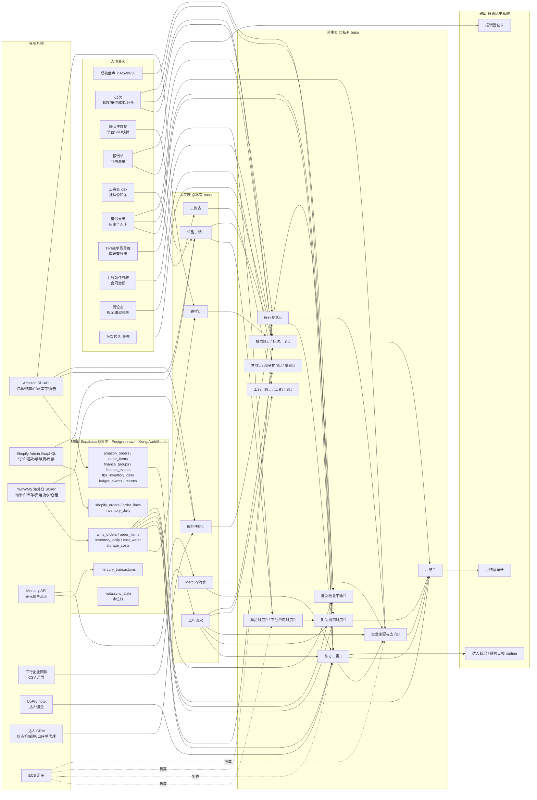
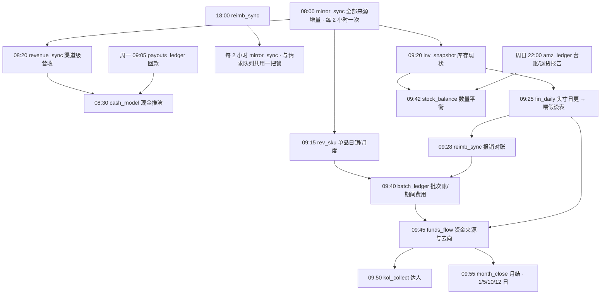

# 数据血缘与依赖关系(管理会计与经营观测系统)

更新:2026-09-14。范围:钱、货、单品、人员、达人、社媒。原则:**人填事实,bot 算派生;原始镜像进数据库,派生表放飞书 base;两套口径并行(管理账=真实用途,税务账=发票)。**

## 一、总图



## 二、数据源清单

| 来源 | 接入方式 | 增量策略 | 落点 | 频率 | 备注 |
|---|---|---|---|---|---|
| Amazon 订单/订单行 | SP-API orders v0 | LastUpdatedAfter,回看 3 天 | raw.amazon_orders / order_items | 每 2 小时 | 订单行限流 0.5 rps,首拉慢 |
| Amazon 结算事件 | SP-API finances v0 | 按事件组;Open 组每次重拉;事件键=组 id+内容哈希 | raw.amazon_finance_groups / finance_events | 每 2 小时 | 结算入账日口径,晚于下单日 |
| Amazon FBA 库存 | SP-API fba/inventory | 每次整表快照 | raw.amazon_fba_inventory_daily;库存快照🤖 | 每天 | 可售/预留/在途/不可售 |
| Amazon 台账/退货报告 | SP-API reports(LEDGER_DETAIL / CUSTOMER_RETURNS) | 60/30 天窗口,行哈希去重 | amz_ledger.json → raw.amazon_ledger_events / returns | 周日 22:00 | 建报告配额约 1/分钟,只跑一个 |
| Shopify 订单 | Admin GraphQL 2026-01 | updated_at 回看 3 天,全 JSON(行/退款/手续费) | raw.shopify_orders / order_lines;单品日销🤖 | 每 2 小时;09:15 | 税不算收入;Seel 加购记附加服务 |
| Shopify 库存 | Admin GraphQL productVariants | 每次快照 | raw.shopify_inventory_daily;库存现状🤖(前台数) | 每天 | 无 read_inventory scope,无分仓 |
| YunWMS 海外仓 | SOAP callService(凭据只在首尔 env) | 出库单按 modify_date 回看 3 天;费用流水按 addDate 回看 7 天;仓租回看 14 天;库存快照 | raw.wms_* | 每 2 小时 | 空日期 0000-00-00 置空;远邦=运营方 |
| Mercury | REST(只读 token) | start 回看 10 天 | raw.mercury_transactions;Mercury流水 | 每天 | 只有 Shopify 打款进账 |
| 工行对公 | 企业网银 CSV(店主月导) | 全量重建,人核科目按四元组保留 | 工行流水 / 工行月度🤖 | 每月 1 日 | 余额连续性核到分 |
| UpPromote | REST v2 | 未付佣金 | 头寸日更🤖 应付·达人佣金 | 每天 | 以后从 Mercury 卡付 |
| 达人 CRM | REST(Supabase 登录) | 状态/邮件/出库单代理 | 达人🤖 等(KOL base) | 09:50 | 寄样出库现改走 YunWMS |
| ECB 汇率 | fx.py(当日参考价,缓存) | — | 各派生表「汇率」列 | 每次重算 | 不用固定 7.2 |

## 三、人填事实(谁、什么时候、喂给谁)

| 表 | 责任人 | 节奏 | 下游 |
|---|---|---|---|
| 期初盘点·2026-09-30 | 许世然(库存)/店主(万里汇、信用卡未报、投资款性质)/李妍莹(TikTok 应收) | 9/30 一次,之后月末 | 头寸日更🤖、资金来源与去向🤖 |
| 批次(套数/单位成本/分仓/状态) | 许世然 | 下单、到货、售罄时 | 库存现状🤖、批次账🤖、批次数量平衡🤖 |
| SKU主数据(平台 SKU 映射) | 许世然/张勇 | 上新时 | 单品日销🤖(未映射会标出) |
| 上线前任务表(实际花费=合同金额,按 S1..S5 标签) | 许世然 | 供应链推进时 | 批次账🤖 投入 |
| 批次投入·补充 | bot 预填,人可改 | 对账发现时 | 批次账🤖 投入 |
| 报销单(飞书表单) | 全员登记、店主审批 | 花钱当下 | 报销对账、批次账🤖(归属产品)、工行流水 报销明细🤖 |
| 工资表 xlsx / 社保公积金 | 王艳婷 | 每月 10 日 | 工资表、工资月度🤖、人员成本口径 |
| 垫付支出 | 店主贴表 | 月末 | 头寸日更🤖 应付股东、期间费用、资金去向 |
| TikTok单品月度(手工) | 李妍莹 | 每月 5 日 | 单品月度🤖(收入);出库件数已由 YunWMS 提供 |
| 假设表 | 店主 | 口径变化时 | 现金推演🤖、情景🤖(bot 只自动喂银行现金/美元现金/汇率) |
| 工行流水 科目·人核 | 店主 | 发现分错时 | 覆盖 科目🤖,重建时保留 |

## 四、派生表血缘(表 ← 输入;脚本;时间;被谁用)

| 派生表 | 输入 | 脚本 / 时间 | 下游 |
|---|---|---|---|
| 营收🤖 / 营收月度🤖 | Shopify 订单、Amazon 订单(渠道级) | revenue_sync.py 08:20 | 现金推演🤖 摘要、经营日报 |
| 现金推演🤖 / 月度🤖 / 补货窗口🤖 / 情景🤖 | 假设表、支出计划、回款线、补货计划、回款🤖、营收🤖、工行末笔余额、Mercury/Shopify/手工美元现金 | cash_model.py 08:30 | 店主本地 HTML、经营日报 |
| 单品日销🤖 / 单品月度🤖 / 平台费用月度🤖 | Shopify 订单行+退款+手续费;Amazon 结算事件按 SellerSKU;TikTok 手工月表;SKU主数据映射;ECB | rev_sku.py 09:15 | 批次账🤖、期间费用(Amazon 广告)、月结 |
| 库存快照🤖 / 库存现状🤖 | YunWMS 库存与出库单、FBA 库存、Amazon 订单行(7 天)、Shopify 前台数、批次表 | inv_snapshot.py 09:20 | 头寸日更🤖 存货估值、批次数量平衡🤖、资金去向、经营日报告警 |
| Mercury流水 / 头寸日更🤖 | 工行末笔余额、Mercury、Shopify 待打款、Amazon 未结算、UpPromote 未付、期初盘点(预付/尾款/工资房租/手工现金)、库存现状🤖、垫付支出、YunWMS 账户余额(镜像) | fin_daily.py 09:25 | 假设表自动喂数、资金去向、月结、周卡(待建) |
| 报销单 付款状态🤖 / 工行流水 报销明细🤖 / 历史报销待补🤖 | 报销单、工行流水(人事·补偿报销) | reimb_sync.py 09:28、18:00 | 批次账🤖(新报销归属产品)、店主私聊卡 |
| 批次账🤖 / 批次月度🤖 / 寄样🤖 / 期间费用月度🤖 | 上线前任务表、批次投入·补充、报销单、批次表、单品日销🤖、YunWMS 出库单(寄样/TikTok)、Amazon 零元订单(FBA 寄样)、镜像 wms_cost_water(尾程)、工行流水、垫付支出、平台费用月度🤖、ECB | batch_ledger.py 09:40 | 月结、周卡、经营日报(可引用) |
| 批次数量平衡🤖 / 批次表 剩余·实物🤖 | amz_ledger.json(台账)、amz_returns.json、YunWMS 出库单、库存现状🤖、批次表分仓 | stock_balance.py 09:42 | 月结、断货判断的交叉核对 |
| 资金来源与去向🤖 | 工行流水(科目)、Mercury流水、垫付支出、期初盘点(预付/手工现金)、库存现状🤖、头寸日更🤖、ECB | funds_flow.py 09:45 | 月结、周卡 |
| 工行月度🤖 | 工行流水 | icbc_csv_to_base.py(月导时)/ retag_laser.py | 资金去向、期间费用 |
| 工资月度🤖 | 工资表、社保公积金、工行流水(工资) | payroll_to_base.py(月导时) | 人员成本口径、期间费用(校验) |
| 月结🤖 | 工行流水、期初盘点、工资表、TikTok 手工、镜像 wms_cost_water/storage、报销单、批次表、单品月度🤖、头寸日更🤖、期间费用/批次月度/资金去向 | month_close.py 1/5/10/12 日 09:55 | 店主私聊卡 |
| 回款🤖 | Amazon 结算打款、Mercury 入账 | payouts_ledger.py 周一 09:05 | 现金推演🤖 |
| 达人🤖 / 日汇总🤖 / 时间线🤖(KOL base) | CRM、UpPromote、Apify/CreatorCrawl | kol_collect.py 09:50 | 达人战况 routine |
| 口碑🤖 / 口碑事件🤖 | CreatorCrawl/Apify、Google News | kol_rep.py 周日 21:30 | 达人战况 routine |
| 社媒日志🤖(舆情 base) | IG/TikTok 数据 | social_collect.py 09:20 | 社媒日报 routine |

## 五、每天的依赖顺序(为什么是这个顺序)



- mirror_sync 每 2 小时一次(整点),08:00 那次正好在派生链之前;应用侧 `mirror.ensure()` 超 3 小时会自己补一次。
- fin_daily 在 inv_snapshot 之后,因为头寸要用当天的存货估值;funds_flow 在最后,因为它引用头寸和存货。
- batch_ledger 依赖 rev_sku 当天的单品日销和 reimb_sync 的归属产品;stock_balance 依赖周日拉的台账 JSON,平时用上周的。
- month_close 只读,放最后;它对「上月」检查,所以 1 日跑最有意义,5/10/12 日是催交节点。

## 六、直连迁移状态(2026-09-14 全部改读镜像)

| 脚本 | 现在读 | 说明 |
|---|---|---|
| revenue_sync.py | raw.shopify_orders、raw.amazon_orders | 口径不变(渠道级营业额/套数) |
| rev_sku.py | raw.shopify_orders.payload、raw.amazon_orders/order_items、raw.amazon_finance_events | Amazon 按下单日,平台费实结或预估 |
| inv_snapshot.py | raw.wms_inventory_daily、raw.wms_orders(+items)、raw.shopify_inventory_daily、raw.amazon_fba_inventory_daily、raw.amazon_orders/order_items | 批次成本/套数取 人核 > 🤖 > 手填 |
| batch_ledger.py | raw.wms_orders(+items)(寄样/TikTok)、raw.amazon_orders(零元单)、raw.wms_cost_water(尾程) | — |
| stock_balance.py | raw.amazon_ledger_events、raw.amazon_returns、raw.wms_orders(+items)、raw.wms_asn_items | 不再读 JSON 报告文件 |
| fin_daily.py | raw.mercury_accounts_daily、raw.mercury_transactions、raw.shopify_finance_daily、raw.amazon_finance_groups(Open)、raw.uppromote_unpaid_daily、raw.wms_cost_water | 新增三张日快照表供它用 |
| payouts_ledger.py | raw.amazon_finance_groups(+events)、raw.mercury_transactions | — |
| batch_master.py | raw.amazon_ledger_events(Receipts)、raw.wms_asn(+items) | 批次派生 |
| month_close.py | raw.wms_cost_water、raw.wms_storage_costs | 海外仓费用 |

仍直连外部系统的只剩 **采集层**:`mirror_sync.py`(全部来源)、`amz_ledger.py`(报告)、`kol_collect.py` / `kol_rep.py` / `social_collect.py`(达人与社媒,不在财务链路)、`icbc_csv_to_base.py`(工行 CSV,人导)。每个派生脚本开头 `mirror.ensure([...], max_age_h=6)`,镜像超过 6 小时会先补同步。

## 七、已知的脆弱点

- **人填字段是根**:批次单位成本、分仓、SKU 映射、期初盘点没填,下游一串表都是「估算」或空;月结卡会点名。
- **两个日期口径**:Amazon 用结算入账日(晚 1–14 天),独立站用下单日;同一个月的「销量」两边不可直接相加,批次账已按各自口径处理。
- **FIFO 剩余 ≠ 实物**:退货再入库、TikTok 出库、寄样都会让 FIFO 偏;断货看库存现状🤖,批次剩余看 剩余·实物🤖。
- **配额**:Amazon 建报告约 1/分钟、订单行 0.5 rps;报告类任务只能串行、后台跑。派生脚本改读镜像后,白天不再碰这些配额。
- **长事务**:同步进程分段提交,DDL 带 lock_timeout,否则会锁住别的写入。
- **名字与实体**:同一人多种写法(别名表在脚本里)、工厂换开票主体(泰兴海路 ↔ 超赢)、远邦 = YunWMS,这些映射都是人定的事实,改了要同步改脚本。

## SKU 档案(sku_report.py,按需)

```
任务表 ─┐                                   ┌─ Google Ads API(campaign×月,只读)
批次/批次账🤖/批次月度🤖 ─┤                   ├─ 平台费用月度🤖(Amazon 广告)
单品日销🤖/单品月度🤖 ─────┤── sku_report.py ──┤─ 镜像 raw.shopify_orders(payload.customerJourneySummary 等)
寄样🤖/库存现状🤖/数量平衡🤖 ┤   (店主私聊触发)   ├─ 镜像 raw.amazon_orders/order_items/finance_events/returns/ledger_events/fba_inventory_daily
补货窗口🤖/工行流水/报销单 ─┘                   └─ 镜像 raw.wms_asn(+items)/wms_inventory_daily/wms_cost_water/wms_storage_costs/uppromote_unpaid_daily/uppromote_referrals(每单佣金→按订单行摊 SKU)
                                   ↓
                     SKU档案🤖(一行/次) + reports/sku_<SKU>_<日期>.md/.html + 店主私聊(卡 + 文件)
```

- 触发:app.py 收到店主私聊「分析 X」/「X 档案」→ 子进程 `sku_report.py X --send`;非店主、非私聊一律忽略。
- 依赖顺序:它只读派生表,所以在每天 09:15~09:58 的派生链之后跑才是最新;白天随时跑用的是当天早上的派生结果 + 镜像最新(镜像 3 小时内不重拉)。
- 分摊口径:Google Ads 里 campaign 名含 monet/charleston 的直接归属,其余(Shopping/教育/未命名)按当月独立站商品收入份额分摊;Amazon 广告按当月 Amazon 商品收入份额分摊;再按月按批次已售份额落到批次。
- 算账段(⑪)的分摊:海外仓入库费/仓储费(账户级,无单号)按本 SKU ASN 实收份额;Amazon 账户级费用(FBA 仓储、退货处理、优惠券/秒杀)按当月 Amazon 商品收入份额;海外仓尾程按出库单平台(SHOPIFY/TIKTOK/OTHER=寄样)归渠道;Amazon 多渠道配送单(sales_channel≠Amazon.com)从 Amazon 实销扣除。
